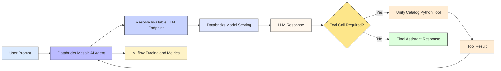
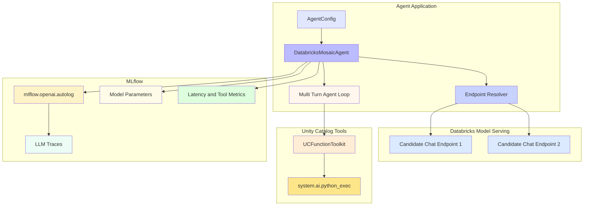
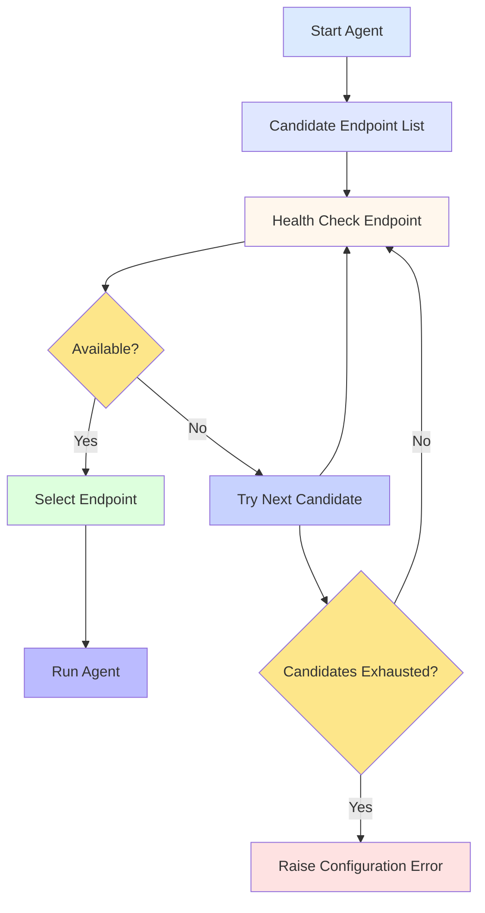

# Databricks Mosaic AI Agent 🤖

A practical, production-oriented starter for building a **tool-enabled AI agent on Databricks** using the Mosaic AI ecosystem, Databricks Model Serving, Unity Catalog functions, and MLflow observability.

The implementation demonstrates model endpoint discovery, direct LLM requests, multi-turn tool calling, reusable agent design, and operational metrics.

---

## Table of Contents

- [Project Overview](#project-overview)
- [Architecture](#architecture)
- [Technology Stack](#technology-stack)
- [Project Structure](#project-structure)
- [Agent Workflow](#agent-workflow)
- [Tool Calling](#tool-calling)
- [Observability](#observability)
- [Setup](#setup)
- [Running the Agent](#running-the-agent)
- [Troubleshooting](#troubleshooting)
- [Production Recommendations](#production-recommendations)
- [Future Enhancements](#future-enhancements)
- [License](#license)

---

## Project Overview

This project builds a reusable Databricks agent abstraction around four core capabilities:

1. Discover a reachable Databricks Model Serving endpoint.
2. Execute normal chat completions against the selected endpoint.
3. Allow the model to invoke the Unity Catalog `system.ai.python_exec` tool.
4. Capture model, latency, and tool-call metrics through MLflow.

The repository intentionally keeps the implementation compact so it can be used as a foundation for more advanced agent workflows.

---

## Architecture

### High-Level Architecture



### Detailed Component Architecture



### Endpoint Fallback Flow



### Architecture Notes

- **AgentConfig** controls candidate model endpoints and the maximum number of tool-loop iterations.
- **DatabricksMosaicAgent** provides the reusable class abstraction.
- **Endpoint resolution** performs a lightweight completion request against candidate serving endpoints and selects the first reachable endpoint.
- **Tool execution** uses `DatabricksFunctionClient` and `UCFunctionToolkit` to expose `system.ai.python_exec`.
- **Agent loop** continues until the model returns a final response or the configured iteration limit is reached.
- **MLflow** captures model identity, latency, tool-call metrics, and OpenAI-compatible traces.

---

## Technology Stack

| Area | Technology |
|---|---|
| AI Platform | Databricks Mosaic AI |
| Model Serving | Databricks Model Serving |
| Agent Runtime | `databricks-agents` |
| OpenAI Client | `databricks-openai` |
| Tools | Unity Catalog Functions |
| Tool Client | `DatabricksFunctionClient` |
| Tool Registry | `UCFunctionToolkit` |
| LLM Observability | MLflow |
| SDK | `databricks-sdk` |
| Language | Python |

---

## Project Structure

```text
.
├── LICENSE
├── README.md
└── main/
    └── first_ai_agent_in_databricks.py
```

### Main implementation

`main/first_ai_agent_in_databricks.py` contains:

- Dependency installation.
- Databricks workspace/client initialization.
- Logging configuration.
- `AgentConfig` definition.
- `DatabricksMosaicAgent` implementation.
- Endpoint availability checks.
- Direct LLM execution.
- Tool-enabled multi-turn agent execution.
- MLflow logging and test runs.

---

## Agent Workflow

### Direct LLM Request

The direct path is intentionally simple:

```text
Prompt
  ↓
Databricks Model Serving
  ↓
LLM Response
  ↓
Latency + Model Metrics in MLflow
```

### Tool-Enabled Agent

The tool workflow is iterative:

```text
User Prompt
    ↓
LLM
    ↓
Tool Call?
  ↙     ↘
Yes      No
 ↓        ↓
Tool     Final Answer
 ↓
Tool Result
 ↓
LLM Again
```

The implementation limits the number of iterations through `max_tool_iterations` to reduce runaway tool loops.

---

## Tool Calling

The current implementation exposes one Unity Catalog function:

`system.ai.python_exec`

When the model emits a tool call, the agent:

1. Parses the tool arguments.
2. Validates the requested tool name.
3. Executes the Unity Catalog function.
4. Converts the response into a tool message.
5. Adds the result back into the conversation.
6. Calls the model again for the next decision.

This provides a clean foundation for adding additional governed tools later.

### Adding another tool

Extend the `function_names` list in `UCFunctionToolkit` and update `_execute_tool()` with the required validation and execution logic.

---

## Observability

The implementation records operational metadata with MLflow.

### Logged parameters

- `llm_model`
- `agent_model`

### Logged metrics

- `llm_latency_sec`
- `agent_latency_sec`
- `tool_calls`

### Tracing

`mlflow.openai.autolog()` is enabled before agent initialization so compatible OpenAI-style calls can be traced through MLflow.

---

## Setup

### Prerequisites

You need:

- A Databricks workspace.
- Model Serving access.
- At least one compatible chat serving endpoint.
- Unity Catalog access for `system.ai.python_exec`.
- Permission to create or write MLflow runs/experiments.

### Install dependencies

The notebook installs the required packages directly:

```python
%pip install -U -qqqq mlflow databricks-openai databricks-agents databricks-sdk
```

After installation, the notebook restarts the Python process so the new packages are available.

---

## Running the Agent

1. Open `main/first_ai_agent_in_databricks.py` as a Databricks notebook or import the exported script into a notebook.
2. Run the cells from top to bottom.
3. Update `DEFAULT_CONFIG.candidate_endpoints` with serving endpoint names available in your workspace.
4. Run the direct LLM test.
5. Run the tool-enabled agent test.
6. Review MLflow traces, parameters, and metrics.

### Example configuration

```python
DEFAULT_CONFIG = AgentConfig(
    candidate_endpoints=[
        "your-primary-endpoint",
        "your-secondary-endpoint",
    ],
    max_tool_iterations=4,
)
```

---

## Testing Examples

The current notebook includes two smoke tests.

### Direct model test

```python
with mlflow.start_run(run_name="llm-test-run", nested=True):
    simple_answer = agent.run_llm("What is the capital of India?")
    print(simple_answer)
```

### Tool-enabled test

```python
with mlflow.start_run(run_name="agent-test-run", nested=True):
    agent_trace = agent.run_agent(
        "Use python to compute the square root of 92 and explain the result in one sentence."
    )
```

---

## Troubleshooting

### No endpoint found

Check:

- Endpoint names in `DEFAULT_CONFIG`.
- Endpoint availability.
- Workspace permissions.
- Whether the serving endpoint supports the Chat Completions interface used by the client.

### Tool call fails

Verify:

- Unity Catalog is enabled.
- `system.ai.python_exec` is available to your principal.
- Tool arguments match the function contract.

### MLflow traces are missing

Check:

- MLflow runtime support.
- Experiment/run permissions.
- That `mlflow.openai.autolog()` executes before model calls.

---

## Production Recommendations

For a production deployment, consider adding:

- Strict tool allowlists and argument validation.
- Authentication and authorization checks for every tool.
- Prompt and model version tracking.
- Structured error handling for malformed tool arguments.
- Timeouts around external tool execution.
- Retry policies for transient model/API errors.
- Persistent agent configuration outside source code.
- Evaluation datasets and automated agent quality checks.
- Cost and latency monitoring by endpoint.
- Unity Catalog governance for tool access.
- CI/CD and automated unit tests.

---

## Future Enhancements

- Add multiple governed Unity Catalog tools.
- Add retrieval tools for enterprise documents and tables.
- Add human approval for sensitive tool calls.
- Add agent evaluation and regression testing.
- Add streaming responses to a web interface.
- Add Databricks Agent Framework deployment patterns.
- Add richer MLflow trace analysis and dashboards.

---

## License

This project is provided under the terms in `LICENSE`.
